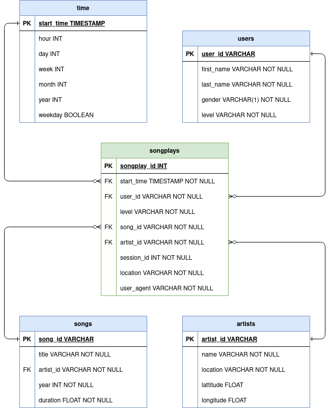

## Sparkify data modeling with AWS Redshift

### About the project

In this project, data from a fictive streaming music company "Sparkify" is retrieved from AWS S3 storage, processed and written to an AWS Redshift data warehouse. Redshift hereby enables easy querying of the data for analysis purposes. This project is part of the Udacity nanodegree Data Engineering.

### Overview

The project contains five python scripts, being:

- **aws_config.py**, containing a script and functions to configure the AWS infrastructure. In particular, said script creates an IAM role for accessing S3 storage, starts a Redshift cluster and sets firewall rules for the VPC to enable remote access to the database;
- **sql_queries.py**, containing all SQL queries for creating the tables and inserting the data into the tables;
- **create_tables.py**, containing a script for executing the SQL create table queries;
- **etl.py**, containing a script for executing the SQL copy and insert queries; and
- **analytics_queries.py**, containing two example analytics queries and a script for executing said queries against the Redshift engine.

The project furthermore contains a configuration document - **template.cfg** - from which configuration parameters are read. Said document must be supplemented with the missing parameters before execution of the above scripts.


### Raw datasets

The raw data to be housed in the data warehouse comprises two datasets: a song dataset and a log dataset. The song dataset consists files in JSON format, each containing metadata about a song. The log dataset consists of log files in JSON format containing app activity logs from a music streaming app.

#### Song data format
The JSON files of the song dataset adhere to the following format:
```
{
    "num_songs": 1, 
    "artist_id":ARJIE2Y1187B994AB7"
    "artist_latitude": null,
    "artist_longitude": null,
    "artist_location": "", 
    "artist_name": "Line Renaud", 
    "song_id": "SOUPIRU12A6D4FA1E1"
    "title": "Der Kleine Dompfaff"
    "duration": 152.92036, 
    "year": 0
}
```

#### Log data format
The JSON files of the log (events) dataset contain entries (rows) that adhere to the following format:
```
{
    "artist":null,
    "auth":"Logged In",
    "firstName":"Walter",
    "gender":"M",
    "itemInSession":0,
    "lastName":"Frye",
    "length":null,
    "level":"free",
    "location":"San Francisco-Oakland-Hayward, CA",
    "method":"GET",
    "page":"Home",
    "registration":1540919166796.0,
    "sessionId":38,
    "song":null,"status":200,
    "ts":1541105830796,
    "userAgent":"\"Mozilla\/5.0 (Macintosh; Intel Mac OS X 10_9_4) AppleWebKit\/537.36 (KHTML, like Gecko) Chrome\/36.0.1985.143 Safari\/537.36\"",
    "userId":"39"
}
```

### Data model

The data is modelled according to the start schema depicted below. The songplays table hereby constitutes the fact table, while the users, artists, songs and time tables are the dimensional tables.



### Infrastructure design

The ETL pipeline extracts data from an S3, stages the data in Redshift and transforms the data to fit the above described star schema.

### Running instructions

Execute the following steps to get an environment running on your system in which to execute the python scripts and run the ETL pipelines against the AWS services:

1. Clone the repository into the working directory and move into the project
   directory:
   ```
   git clone https://github.com/bastiaanhoeben/sparkify-redshift.git
   ```
   ```
   cd sparkify-redshift
   ```   

2. Create a virtual environment and activate it:
   ```
   python3 -m venv .venv
   ```
   ```
   source .venv/bin/activate
   ```
   
3. Install the necessary packages from requirements.txt:
   ```
   python -m pip install -r requirements.txt
   ```

4. Fill in the *template.cfg* TOML configuration document with the required parameters.

5. Run the *aws_config.py* script to set up a Redshift database instance:
   ```
   python aws_config.py
   ```

6. Run the *create_tables.py* script to create the staging and final tables in Redshift:
   ```
   python create_tables.py
   ```

7. Run the *etl.py* script to load the raw data into the staging tables, transform the data from the staging tables to adhere to the data model and insert the transformed data into the final fact and dimensional tables:
   ```
   python etl.py
   ```

8. Run the *analytics_queries.py* script to perform a number of example queries against the Redshift data warehouse:
   ```
   python analytics_queries.py
   ```